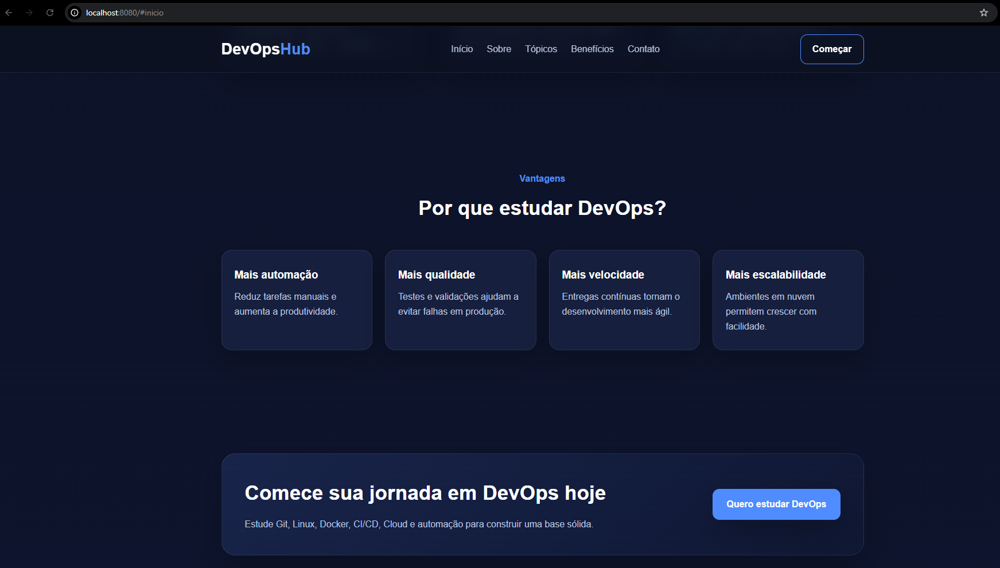
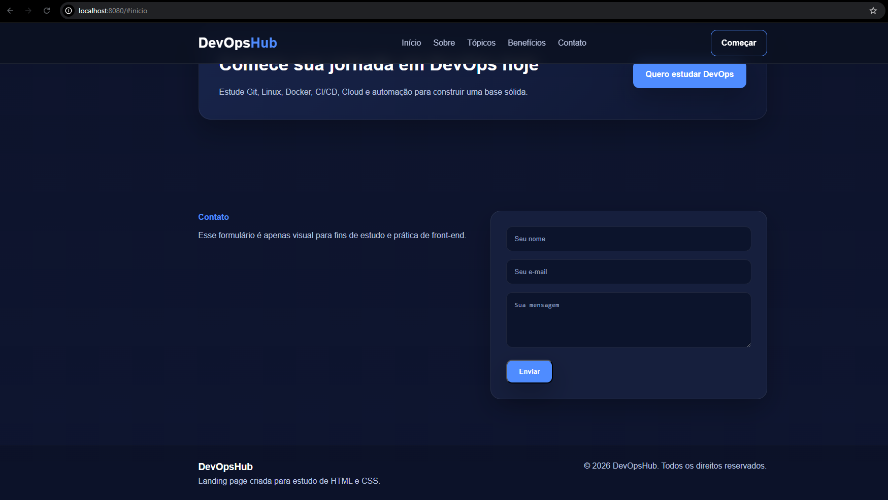

# Projeto DevOps com Docker, Nginx e Linux


---

## Sobre o projeto

Este projeto demonstra a criação e o deploy de uma aplicação web simples utilizando **Docker**, **Docker Compose** e **Nginx** em ambiente Linux.

O objetivo é simular um cenário real de **DevOps**, aplicando conceitos como:

* Containerização
* Automação
* Orquestração
* Boas práticas de estrutura de projeto

---

## Arquitetura

```
Usuário (Navegador)
        ↓
localhost:8080
        ↓
Docker Container
        ↓
Nginx
        ↓
Aplicação HTML/CSS
```

---

## Tecnologias utilizadas

* Linux
* Docker
* Docker Compose
* Nginx
* Bash Script
* Git

---

## Estrutura do projeto

```
devops-app-deploy/
├── app/                # Aplicação HTML/CSS
├── docker/             # Dockerfile
├── scripts/            # Scripts de automação
│   └── healthcheck.sh
├── docker-compose.yml  # Orquestração dos containers
└── README.md
```

---

## Como executar o projeto

### 1. Clonar o repositório

```bash
git clone https://github.com/Kalebes1/devops-app-deploy
cd devops-app-deploy
```

---

### 2. Subir a aplicação

```bash
docker compose up -d --build
```

---

### 3. Acessar no navegador

```
http://localhost:8080
```

---

## Health Check

Script responsável por validar se a aplicação está online.

### Executar:

```bash
./scripts/healthcheck.sh
```

### Resultado esperado:

* Aplicação online
* Aplicação offline

---

## Atualização da aplicação

Sempre que houver alteração no código:

```bash
docker compose down
docker compose up -d --build
```

---

## Funcionamento do projeto

* O Docker cria um container baseado na imagem do Nginx
* A aplicação HTML é copiada para dentro do container
* O Nginx serve a aplicação na porta 80
* O Docker Compose expõe a aplicação na porta 8080
* O script de health check valida se o serviço está ativo

---

## Conceitos aplicados

* Containerização com Docker
* Orquestração com Docker Compose
* Automação com Bash
* Health check de aplicação
* Estruturação de projeto DevOps
* Exposição de serviços via portas

## Preview




---

## Autor

**Kalebe Silva**
[kalebes953@gmail.com](mailto:kalebes953@gmail.com)
(61) 9 9193-8281
https://www.linkedin.com/in/kalebe-silva-208135197/

---

##  Observações

Este projeto faz parte do meu aprendizado em **DevOps, Cloud e Linux**, com foco em automação, escalabilidade e boas práticas de infraestrutura.
